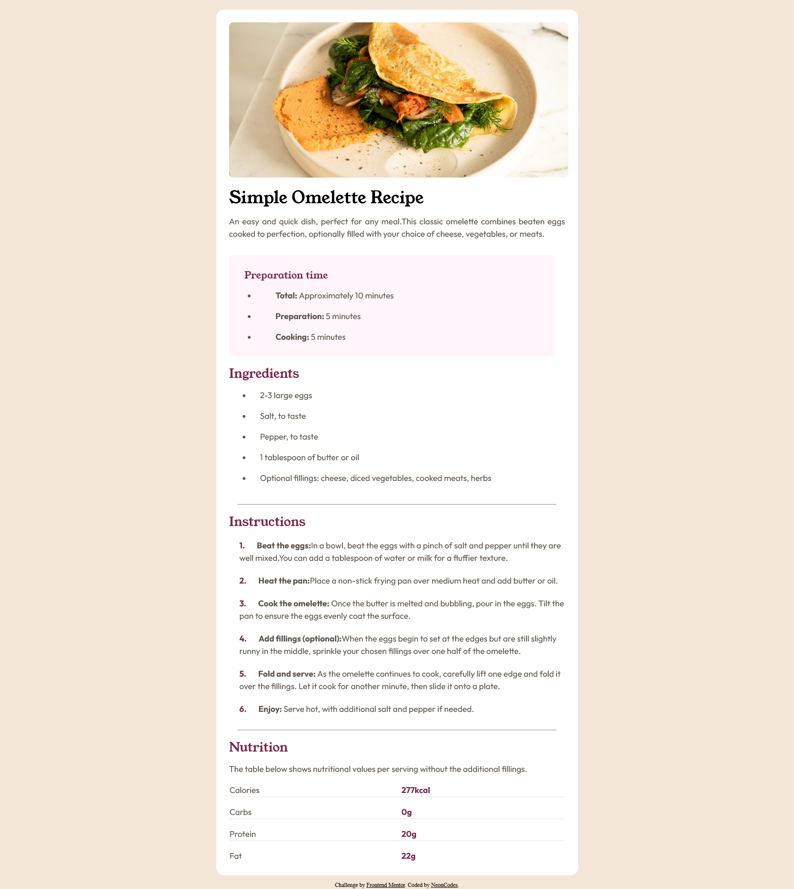

# Frontend Mentor - Recipe page solution

This is a solution to the [Recipe page challenge on Frontend Mentor](https://www.frontendmentor.io/challenges/recipe-page-KiTsR8QQKm). Frontend Mentor challenges help you improve your coding skills by building realistic projects. 

## Table of contents

- [Overview](#overview)
  - [The challenge](#the-challenge)
  - [Screenshot](#screenshot)
  - [Links](#links)
- [My process](#my-process)
  - [Built with](#built-with)
  - [What I learned](#what-i-learned)
  - [Useful resources](#useful-resources)
- [Author](#author)

## Overview

### Screenshot

### Links

- Solution URL: [Add solution URL here](https://github.com/NeonCodes/Recipe-page-challenge-Front-end-Mentor)
- Live Site URL: [live site URL here](https://recipepagefem.netlify.app/)

## My process

### Built with

- Semantic HTML5 markup
- Flexbox

### What I learned
Refresher: lists and tables in HTML

### Useful resources

- [W3docs](https://www.w3docs.com/snippets/html/how-to-control-the-space-between-bullets-and-li-elements.html) - This helped me add spaces between bullets and list elements.
- [GeeksforGeeks](https://www.geeksforgeeks.org/how-to-customize-the-numbers-of-an-ordered-list-using-css/) - This allowed me to color the numbers in the list.(after removing the default margin and padding)
- [W3schools](https://www.w3schools.com/html/html_tables.asp) - Good HTML Tables article.
- [Stackoverflow](https://stackoverflow.com/questions/8522337/using-an-hr-tag-with-a-table) - Helped adding the lines between the table rows.

## Author
- Frontend Mentor - [@NeonCodes](https://www.frontendmentor.io/profile/yourusername)
